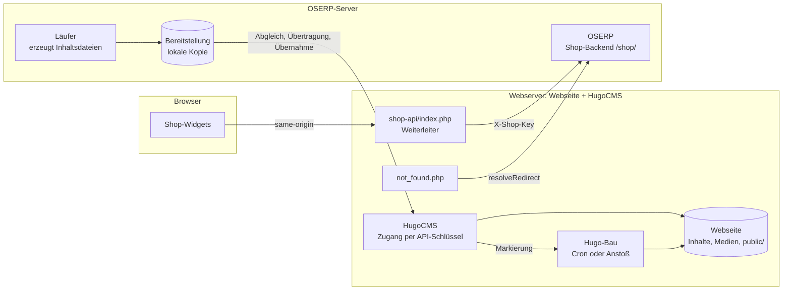

# Shop: Aufteilung zwischen OSERP und HugoCMS

Stand 2026-09-24. Status: **Schritte 1 bis 4 umgesetzt** (Zugang, Bau,
Übertragung, Vorschaubilder, Betriebsart), dazu E9 (Paket ohne PHP über
HugoCMS). Offen: Schritt 5 (Stufe F).

Bisher erledigt OSERP die ganze Veröffentlichung selbst: Es schreibt die
Inhaltsdateien in das Verzeichnis der Webseite und startet Hugo. Künftig laufen
Webseite und HugoCMS auf einem eigenen Webserver, und HugoCMS übernimmt den Bau.
OSERP liefert nur noch Inhalte und bleibt das Backend für Sitzung, Bestellung
und Rechnung.

Verwandte Dokumente: `dev/shop-veroeffentlichung.md` (Seitenerzeugung heute),
`dev/shop-betrieb.md` (Betrieb heute), `dev/shop-bridge-abloesung.md` (Stufe F,
Lieferantenimport). Die Regeln für Arbeiten an HugoCMS stehen in
`hugocms-2026/CLAUDE.md` und gelten dort vor allem, was hier steht.

## Aufgabengebiete

| Gebiet | Zuständig | Umfasst |
| --- | --- | --- |
| 1. Rechnungsstellung, Artikel- und Kundenverwaltung | OSERP | Bestellungen, Rechnungen samt PDF, Kunden, Artikel, **Sitzungen der Shop-Besucher**, Erzeugen der Inhaltsdateien (Produktseiten, Kategorieübersicht) und des Webseiten-Pakets |
| 2. Publishing | HugoCMS | Hugo steuern und bauen — aus dem eigenen Cron oder auf Anstoß von OSERP |
| 3. Shop-UI | OSERP baut, die Webseite liefert aus | Web Components (Lit). Gebaut mit Node auf dem OSERP-Server, als eine Datei im Webseiten-Paket übertragen |

## Entscheidungen

| Nr. | Entscheidung | Datum |
| --- | --- | --- |
| E1 | OSERP bleibt zuständig für Gebiet 1, einschließlich PDF-Rechnungen, Inhaltsdateien und Sitzungsverwaltung | 2026-09-24 |
| E2 | Das Publishing übernimmt HugoCMS. Der Läufer in OSERP erzeugt nur noch die Inhaltsdateien; ein Cron auf der HugoCMS-Seite steuert Hugo | 2026-09-24 |
| E3 | Webshop und HugoCMS laufen zusammen auf einem eigenen Webserver | 2026-09-24 |
| E4 | Kein zusätzlicher Proxy-Server. Die Aufrufe der Shop-UI gehen über ein Backend auf dem Webserver, das sie an OSERP weiterreicht (Sitzung, Bestellung, Rechnung) | 2026-09-24 |
| E5 | HugoCMS bekommt neben dem sitzungsbasierten Zugang einen Zugang per API-Schlüssel, über den OSERP Vorgänge auslöst. Jeder Schlüssel gehört zu genau einem Webprojekt | 2026-09-24 |
| E6 | **Die Medien bleiben auf der Webseiten-Seite**: Produktbilder, Downloads und Vorschaubilder. OSERP kennt nur ihre Dateinamen | 2026-09-24 |
| E7 | Transport über die HugoCMS-API, von OSERP angestoßen (Weg A unten, vorher Empfehlung R1) | 2026-09-24 |
| E8 | Die heutige Arbeitsweise bleibt als Betriebsart „lokal" erhalten; „HugoCMS" kommt als zweite Betriebsart hinzu (vorher Empfehlung R2) | 2026-09-24 |
| E9 | HugoCMS bleibt ohne PHP. Die Paket-Konfiguration wird `oserp-shop/config.json` und reist mit der Übertragung; Weiterleiter und 404-Seite legt man einmal von Hand auf den Webserver | 2026-09-24 |

## Ausgangslage

**Schon vorhanden und weiter verwendbar:**

- **Weiterleiter für die Shop-UI.** Das Paket enthält
  `kit/static/shop-api/index.php`, das auf dem Webserver der Webseite läuft —
  als PHP-Skript, nicht als eigener Proxy-Server.
  - Es hält die Aufrufe der Widgets auf der Adresse der Webseite. Das
    Sitzungs-Cookie (`SameSite=Strict`) kommt deshalb an.
  - Den Shop-Schlüssel (`X-Shop-Key`) trägt es serverseitig aus
    `oserp-shop/config.json` nach (bis E9 `config.php`).
  - Es reicht `Set-Cookie`, `Content-Disposition` und `Location` durch.

  Damit ist E4 bereits erfüllt, der Weiterleiter bleibt unverändert.
- **Umleitungen.** `kit/static/not_found.php` fragt `resolveRedirect` bei OSERP
  ab. Bleibt ebenfalls unverändert.
- **Bau in HugoCMS.** `Connector::runHugoBuild()` baut die Webseite auf dem
  Webserver selbst. `backend/cli/cron-build.php` baut aus dem Cron, bisher aber
  nur bei fälligen terminierten Freigaben oder mit `--force`.
- **Mandantenfähigkeit in HugoCMS.** Eine Installation bedient mehrere
  Webseiten. Jede Webseite ist ein `SiteKey` (Host plus Endpunkt-Verzeichnis)
  mit eigener Mount-Datei `backend/mounts/<sha256(siteKey)>.ini`.

**Mengen am Beispiel sonic24.de:**

| Was | Umfang | Wer erzeugt es |
| --- | --- | --- |
| Produktseiten `content/de/produkt/` | 3713 Dateien, gepackt 1,5 MB | OSERP |
| Webseiten-Paket `oserp-shop/`, mit Shop-UI-Bündel | 25 Dateien, 320 KB | OSERP |
| Kategorieübersicht `data/category_groups.json` | 1 Datei, 20 KB | OSERP |
| Produktbilder `static/images/products/` | 7486 Dateien, 476 MB | bleibt auf der Webseite (E6) |
| Downloads | 954 Dateien, 2,5 GB | bleibt auf der Webseite (E6) |
| Vorschaubilder `static/images/thumbnails/` | 3642 Dateien, 20 MB | bisher OSERP, künftig HugoCMS (E6) |

Was OSERP überträgt, ist klein: Selbst eine Vollübertragung ist unkritisch,
Änderungen umfassen meist wenige Kilobyte.

**Was HugoCMS noch fehlt:** Zugang per Schlüssel, Empfang von Dateien, Bau nach
Inhaltsänderung und eine Abfrage des Baustands. Eingehende Schlüssel oder Tokens
kennt HugoCMS bisher gar nicht; alle `api_key`-Einstellungen dort sind
ausgehend.

## Zielbild

## Datenflüsse

### 1. Inhalte: OSERP → HugoCMS

Der Läufer schreibt Produktseiten, Kategorieübersicht und Webseiten-Paket wie
bisher, aber in ein **Bereitstellungsverzeichnis auf dem OSERP-Server**. Es hat
dieselbe relative Gliederung wie die Webseite (`content/de/produkt/…`,
`data/category_groups.json`, `oserp-shop/…`). Danach gleicht er ab:

1. **Abgleich.** OSERP schickt ein Verzeichnis aller verwalteten Dateien mit
   Prüfsumme (SHA-256). HugoCMS antwortet mit der Liste der Dateien, die fehlen
   oder abweichen.
2. **Übertragung.** OSERP schickt nur diese Dateien, gebündelt in Portionen
   unter der Upload-Grenze von HugoCMS (50 MiB).
3. **Übernahme.** Ein abschließender Aufruf übernimmt die Portionen in einem
   Zug und löscht verwaltete Dateien, die nicht mehr im Verzeichnis stehen.
   Gelöscht wird nur innerhalb der verwalteten Bereiche. Danach setzt HugoCMS
   die Bau-Markierung.

Vorher wird nie gebaut: Eine halb übertragene Lieferung darf nicht auf der
Webseite landen.

### 2. Shop-Aufrufe: Browser → Weiterleiter → OSERP

Unverändert. Voraussetzung ist, dass der Webserver OSERP per HTTPS erreicht;
das ist heute schon so.

### 3. Bau: HugoCMS

`cron-build.php` baut zusätzlich, wenn die Bau-Markierung einer Übernahme
vorliegt. Damit nicht zwei Cron-Takte hintereinander warten (bis zu zweimal
fünf Minuten), stößt OSERP den Bau nach der Übernahme direkt an. Der Cron
bleibt der Rückfall.

Den Baustand fragt OSERP ab, wie heute die Karte „Veröffentlichung" den
eigenen Lauf abfragt: alle 2 s, nach einer Minute alle 5 s, nach 15 Minuten
Schluss.

### 4. Medien: bleiben auf der Webseite (E6)

- Produktbilder und Downloads kommen auf dem Webserver an, nicht in OSERP.
  **Stufe F** (Lieferantenimport) muss danach entworfen werden: Der Import
  liefert die Bilder dorthin, nicht nach OSERP.
- **Vorschaubilder erzeugt HugoCMS.** Heute liest OSERP die Produktbilder aus
  der Webseite und rechnet sie herunter (`shopThumbnailFor()`). Das geht auf
  getrennten Servern nicht mehr. Zwei Wege:

  | Weg | Bewertung |
  | --- | --- |
  | a) HugoCMS rechnet fehlende Vorschaubilder bei der Übernahme mit GD herunter | **Empfehlung.** Reines PHP, passt zu Shared Hosting. Die Adressen in den Produktseiten (`shop_thumbnails_link`) bleiben, wie sie sind |
  | b) Hugos eigene Bildverarbeitung | Bilder müssten nach `assets/`, das Theme änderte sich, und jeder Bau verarbeitet 7486 Bilder |

- Das Verzeichnis beim Abgleich nennt je Produktseite die benötigten Bilder.
  HugoCMS meldet bei der Übernahme, welche fehlen. OSERP zeigt das unter
  „Meldungen des letzten Laufs" als Warnung — heute prüft es das selbst.

## Schnittstelle OSERP → HugoCMS

Entwurf. Namen und Form folgen den HugoCMS-Konventionen: Befehle über `cmd`,
klein und ohne Trennzeichen; Fehler als `{ok:false, error:{code, key, params}}`
ohne übersetzten Text.

| Befehl | Zweck |
| --- | --- |
| `shopmanifest` | Verzeichnis entgegennehmen, fehlende oder abweichende Dateien nennen |
| `shopupload` | eine Portion Dateien entgegennehmen und bereitlegen |
| `shopcommit` | Portionen übernehmen, Überzähliges löschen, Vorschaubilder erzeugen, fehlende Bilder melden, Bau-Markierung setzen |
| `shopbuild` | Bau sofort anstoßen, ohne auf den Cron zu warten |
| `shopbuildstatus` | Stand: baut, fertig oder fehlgeschlagen; letzte Zeilen der Hugo-Ausgabe |
| `shopthumbnails` | Vorschaubilder zu den genannten Bildnamen erzeugen, fehlende Bilder melden (umgesetzt als eigener Befehl statt in `shopcommit`, siehe Schritt 3) |

**Anmeldung.** Der Kopf `Authorization: Bearer <Schlüssel>` (ersatzweise
`X-HugoCMS-Key`, falls der Webserver `Authorization` nicht an PHP weiterreicht)
wird von der eigenen Klasse `Shop\ShopKey` geprüft. Ursprünglich war ein
`AuthInterface`-Treiber geplant; die Schnittstelle beschreibt aber die Anmeldung
von Benutzern (Passwort, Sitzung, Konten) und passt nicht auf einen Schlüssel für
Maschinenaufrufe, der die Anmeldung der Redakteure ja nicht ersetzt, sondern
daneben steht. Die Zuordnung zum Webprojekt ergibt sich aus dem Aufbau von HugoCMS:
Es bestimmt die Webseite aus Host und Endpunkt, bevor es anmeldet, und findet
den Schlüssel-Hash in genau deren Mount-Datei.
- Gespeichert wird nur der Hash.
- Der Schlüssel ist erneuerbar.
- Eine CSRF-Prüfung entfällt für diesen Zugang, weil kein Browser beteiligt
  ist.

**Schreibrechte.** Geschrieben wird nur über `FileService`/`MountResolver`, und
nur in eigens dafür angelegte Mounts der Webseite:

| Mount | Ziel |
| --- | --- |
| Produktseiten | `content/de/produkt` |
| Datendatei | `data` |
| Paket | `oserp-shop` |

Die Mounts der Redakteure bleiben davon getrennt.

## Betriebsarten in OSERP (R2)

| | lokal (heute) | HugoCMS |
| --- | --- | --- |
| Inhaltsdateien | direkt in die Webseite | in die Bereitstellung, dann Übertragung |
| Bau | OSERP startet Hugo | HugoCMS |
| Vorschaubilder | OSERP | HugoCMS |
| Einstellungen | `shop_sites_dir`, `shop_site_dir`, `shop_publish_command_path`, `shop_publish_clean_destination` | HugoCMS-Adresse (`cms-api` der Webseite), API-Schlüssel (Geheimnis wie die Shop-Schlüssel) |
| Karte „Veröffentlichung" | Stand des eigenen Laufs | eigener Lauf plus Baustand von HugoCMS |

Kleine Installationen, bei denen ERP und Webseite auf einem Server liegen,
bauen damit weiter selbst. Hintergrundlauf, Standanzeige und Bau-Programm aus
der heutigen Veröffentlichung gelten dort unverändert.

## Änderungen in OSERP

- Einstellung „Betriebsart" je Mandant in `defaults_oserp`, dazu HugoCMS-Adresse
  und API-Schlüssel.
- `shopPublishRun()`: In der Betriebsart HugoCMS schreibt er in die
  Bereitstellung. Statt des Baus folgen Abgleich, Übertragung, Übernahme und
  Anstoß.
- `shopThumbnailFor()` entfällt in dieser Betriebsart. Das Verzeichnis beim
  Abgleich trägt die Bildnamen je Seite.
- Ein ausgehender HugoCMS-Client mit cURL, nach dem Muster der vorhandenen
  Aufrufe.
- Karte „Veröffentlichung": Baustand von HugoCMS anzeigen, fehlende Bilder als
  Warnung.
- Dokumentation: `dev/shop-betrieb.md`, `docs/settings-ini.md`.

## Änderungen in HugoCMS

Gegen die Prinzipien in `hugocms-2026/CLAUDE.md` geprüft: zustandslos, kein
Composer, keine Symlinks, Mount-Sicherheit als Grenze. Der neue Zugang berührt
die Anmeldung und braucht laut CLAUDE.md vorher die Zustimmung des Inhabers.

- Auth-Treiber für den API-Schlüssel; Hash in der Mount-Datei der Webseite.
- Oberfläche zum Erzeugen und Erneuern des Schlüssels; der Schlüssel wird nur
  einmal angezeigt. Texte in `frontend/src/i18n/de.js` und `en.js`.
- Die fünf Befehle oben, geschrieben ausschließlich über `FileService`.
- Bereitlegen der Portionen unter `backend/var/shop/<sha1(Quelle)>`, wie die
  übrigen Laufzeitdaten je Webseite.
- Bau-Markierung, die `cron-build.php` abholt; Baustand als Datei im selben
  Bereich.
- Vorschaubilder mit GD beim Übernehmen; die Größe kommt im Verzeichnis mit.
- `bin/install.sh` oder `mounts.ini.beispiel`: die drei Shop-Mounts als
  Vorlage.

## Sicherheit

- Der Schlüssel-Zugang nimmt nur HTTPS-Aufrufe an.
- Grenzen je Aufruf: Anzahl der Dateien, Größe, erlaubte Endungen (`md`,
  `json`, `php` nur im Paket-Mount, `js`, `html`, `css`).
- Pfade kommen nur relativ und nur innerhalb der drei Shop-Mounts an; `..` ist
  verboten, wie überall in HugoCMS.
- Der Shop-Schlüssel (OSERP) und der HugoCMS-Schlüssel sind zwei getrennte
  Geheimnisse mit getrennten Aufgaben. Keines taugt für die Richtung des
  anderen.
- Das Paket enthält PHP (Weiterleiter, `not_found.php`). Wer den HugoCMS-Schlüssel
  hat, kann also PHP auf dem Webserver ablegen. Der Paket-Mount nimmt deshalb
  ausschließlich die Dateien an, die im Paket vorgesehen sind; die Liste dazu
  kommt aus dem Vorlagensatz.

## Risiken

| Risiko | Gegenmaßnahme |
| --- | --- |
| Bau während einer halben Übertragung | gebaut wird nur nach `shopcommit` |
| Verzögerung durch zwei Crons | OSERP stößt nach der Übernahme mit `shopbuild` an |
| Falsche Adresse (HugoCMS erkennt die Webseite an Host plus Endpunkt) | OSERP ruft genau die `cms-api`-Adresse der Webseite auf; ein Verbindungstest beim Speichern der Einstellung |
| Bilder, auf die eine Seite verweist, fehlen | HugoCMS meldet sie bei der Übernahme, OSERP zeigt sie an |
| Shared Hosting ohne GD | Vorschaubilder entfallen; Meldung statt Abbruch |

## Umsetzungsschritte

1. **Schlüssel-Zugang und Baustand in HugoCMS** — `shopbuild`,
   `shopbuildstatus`. Ohne Dateiübertragung testbar: OSERP stößt einen Bau an
   und verfolgt ihn. **Erledigt 2026-09-24**, siehe unten.
2. **Übertragung** — `shopmanifest`, `shopupload`, `shopcommit`, die drei
   Mounts, Bau-Markierung im Cron. **Erledigt 2026-09-24.**
3. **Vorschaubilder in HugoCMS**, fehlende Bilder melden. **Erledigt
   2026-09-24.**
4. **Betriebsart „HugoCMS" in OSERP** — Bereitstellung, Client, Einstellungen,
   Anzeige. **Erledigt 2026-09-24.**
5. **Stufe F** (Lieferantenimport), mit Bildern auf der Webseiten-Seite.

## Offene Fragen

- ~~R1 und R2 bestätigen.~~ Entschieden als E7 und E8 (2026-09-24).
- Unter welchem Benutzer läuft der HugoCMS-Cron, und darf er in die Shop-Mounts
  schreiben?
- Wie kommen Produktbilder aus dem Lieferantenimport auf den Webserver — über
  denselben Schlüssel-Zugang mit einem eigenen Medien-Befehl oder direkt vom
  Lieferanten? Klärt Stufe F.

## Stand der Umsetzung

### Schritt 1 (2026-09-24)

**HugoCMS**
- `backend/core/Shop/ShopKey.php`: Schlüssel erzeugen (`hcs_` plus 32
  Zufallsbytes), SHA-256-Hash, Vergleich in konstanter Zeit, Schlüssel aus der
  Anfrage lesen, Transport prüfen (HTTPS, sonst nur Loopback).
- `backend/core/BuildLock.php`: **Sperre für alle Hugo-Läufe einer Webseite**
  und der letzte Lauf in `var/build/<sha1(Quelle)>/last.json`. Vorher konnten
  Knopf und Cron gleichzeitig in dasselbe Ziel bauen; jetzt wartet der spätere.
  Wirkt auf alle drei Auslöser, nicht nur auf die Shop-Anbindung.
- `MountConfig`: reservierte Sektion `[shop]` (`key_hash`, `key_hint`,
  `key_created`).
- `Connector`: `shopbuild` und `shopbuildstatus` (Schlüssel), `shopkeycreate`
  und `shopkeydelete` (Sitzung, nur `config.manage` über
  `requireConfigAdmin()`); `projectconfig` meldet, ob ein Schlüssel hinterlegt
  ist. Der Pausenschalter `pause_build` gilt auch für `shopbuild`.
- Projekteinstellungen: Abschnitt „Shop-Anbindung" mit der Adresse für OSERP,
  Schlüssel erzeugen, ersetzen, entfernen; der Schlüssel erscheint einmal zum
  Kopieren. Texte in `de.js` und `en.js`.
- `README.md` (Abschnitt „Shop-Anbindung", Befehle, Rechte, Sicherheit),
  `mounts.ini.beispiel`, `.gitignore` (`backend/var/build/`).

**OSERP**
- `backend/api/shop/lib/hugocms.php`: Client mit cURL. Schickt den Schlüssel
  über http nur zur Loopback-Adresse, folgt keinen Umleitungen, übersetzt die
  Fehlercodes von HugoCMS.
- Einstellungen `shop_hugocms_url`, `shop_hugocms_key` (Geheimnis, geht nie an
  den Browser), in der Firmenkonfiguration unter Shop als Gruppe „HugoCMS" mit
  dem Knopf „Verbindung prüfen" (`testShopHugoCms`). Der Knopf prüft die Werte
  im Formular, auch wenn sie noch nicht gespeichert sind.
- Texte in 21 Sprachen.

**Getestet** gegen die HugoCMS-Entwicklungsinstanz: ohne Schlüssel, falscher
Schlüssel, beide Kopfzeilen, falsche Methode, Schlüsselverwaltung ohne Sitzung
und mit bloßem Shop-Schlüssel (abgewiesen), Bau über `shopbuild`, Bausperre mit
zwei Prozessen; auf OSERP-Seite neun Fälle des Clients (unter anderem http zu
fremdem Rechner, nicht erreichbar, Adresse ohne Schrägstrich) und der Endpunkt
mit Formularwerten.

**Noch nicht:** Der Bau wird nicht aus dem Veröffentlichungslauf angestoßen —
das gehört zur Betriebsart „HugoCMS" (Schritt 4).

### Schritte 2 und 4 (2026-09-24)

**Abweichung vom Entwurf: keine drei Mounts.** Ein HugoCMS-Mount verlangt beim
Laden ein vorhandenes Verzeichnis — ein Mount auf `oserp-shop/` hätte eine
frische Webseite beim Laden abgebrochen. Stattdessen ein eigener Mount auf die
Hugo-Quelle, der nur im Übertragungsdienst existiert (nicht im Resolver der
Redakteure), begrenzt durch **Bereiche** (`[shop] areas`, Vorgabe
`content/de/produkt/`, `data/category_groups.json`, `oserp-shop/`) und
**Endungen** (`md`, `json`, `html`, `js`, `css`). Geschrieben wird weiterhin
nur über `FileService`, wie die HugoCMS-Regeln es verlangen.

**Löschen nur, was OSERP selbst geliefert hat.** In `content/de/produkt/` von
sonic24 liegt eine von Hand angelegte `_index.md`. „Alles löschen, was nicht im
Verzeichnis steht" hätte sie vernichtet. HugoCMS merkt sich deshalb die vorige
Lieferung (`last-manifest.json`) und löscht nur, was dort stand und jetzt fehlt.

**HugoCMS**
- `Shop/ShopSync.php`: Abgleich, Übertragung in die Bereitstellung, Übernahme.
- `FileService::remove()`: endgültig löschen ohne Papierkorb — für Bereiche,
  deren Stand eine Quelle außerhalb von HugoCMS hält.
- `cron-build.php` baut auch, wenn eine Lieferung wartet (Markierung
  `build-pending`). Jeder Bau nimmt sie zu Beginn zurück; **scheitert er, setzt
  er sie wieder** — sonst ginge eine Lieferung nach einem Fehlschlag verloren.
- `shopbuildstatus` meldet zusätzlich wartende Lieferung, Bereiche und Endungen.
- Die Projekteinstellungen zeigen die geltenden Bereiche.

**OSERP**
- Einstellung **Betriebsart** (`shop_publish_mode`: `local` oder `hugocms`).
- Betriebsart HugoCMS: `shopSiteDir()` liefert die Bereitstellung
  `backend/tmp/shop-publish-<db>-staging/`. Seiten, Paket und
  Kategorieübersicht schreiben dadurch ohne weitere Änderung dorthin.
- Statt des lokalen Baus: Übertragung (Portionen bis 1,5 MB oder 500 Dateien),
  dann `shopbuild`. Hat sich nichts geändert, bleibt es bei einer Abfrage des
  Baustands — höchstens einen Tag lang, dann wird trotzdem abgeglichen.
- Was HugoCMS nicht annimmt, wird nicht verschickt, sondern im Lauf gemeldet.
- Vorschaubilder erzeugt OSERP in dieser Betriebsart nicht (E6), sondern
  HugoCMS (Schritt 3).
- Bereitschaftsprüfung je Betriebsart; Auswahlfeld mit übersetzten Werten.

**Getestet** mit einer eigenen HugoCMS-Testwebseite (`shoptest.localhost`):
- Abweisungen im Abgleich: außerhalb der Bereiche, PHP, `.htaccess`, `..`,
  doppelter Pfad; falsche Prüfsumme, nicht angekündigte Datei; Übernahme vor
  vollständiger Übertragung.
- Zwei Lieferungen nacheinander: Änderung übertragen, entfallene Datei
  gelöscht, `_index.md` unberührt; Cron baut nach einer Übernahme, danach nicht
  mehr.
- **Ganzer Weg** mit Werkzeug24 in der Betriebsart HugoCMS (in einer
  zurückgerollten Transaktion): echter Artikel und Paket erzeugt, 24 Dateien
  übertragen, drei PHP-Dateien als nicht angenommen gemeldet, in HugoCMS
  gebaut; die Produktseite bindet das Widget-Bündel mit derselben Prüfsumme ein
  wie sonic24. Zweiter Lauf: nichts zu übertragen.
- Gescheiterter Bau: Lieferung bleibt vorgemerkt, nach der Reparatur gebaut.

**PHP-Dateien des Pakets (entschieden als E9).** HugoCMS schreibt bewusst kein
PHP. Gewählt wurde, diese Grenze stehen zu lassen:
- `oserp-shop/config.php` ist jetzt `oserp-shop/config.json`
  (`shopKitConfig()`). Sie ändert sich mit jedem neuen Shop-Schlüssel und reist
  deshalb mit der Übertragung. Weiterleiter und 404-Seite lesen sie mit
  `json_decode()`. In der Betriebsart „lokal" entfernt der nächste
  Paketabgleich die alte `config.php` und schreibt die JSON-Datei; weil er im
  selben Lauf auch neu baut, bekommt `public/` den passenden Weiterleiter im
  selben Zug.
- `oserp-shop/static/shop-api/index.php` und `oserp-shop/static/not_found.php`
  legt man in der Betriebsart HugoCMS einmal von Hand ab (Anleitung in
  `dev/shop-betrieb.md`). Der Lauf nennt sie, sobald er etwas überträgt, und
  sonst nichts.

Getestet: lokaler Paketabgleich an einer Kopie des sonic24-Pakets (alte
`config.php` entfernt, `config.json` geschrieben, beide Einstiegspunkte
erneuert); der neue Weiterleiter erreicht mit der JSON-Datei das Shop-Backend
von OSERP, ohne sie meldet er 503. In der Betriebsart HugoCMS kommt
`config.json` mit (25 statt 24 Dateien), keine PHP-Datei wird übertragen, und
der Lauf nennt nur die zwei Einstiegspunkte.

### Schritt 3 (2026-09-24)

**Abweichung vom Entwurf: eigener Befehl statt Teil der Übernahme.** Ein erster
Lauf betrifft über 3600 Bilder; das in `shopcommit` zu rechnen, sprengte die
Laufzeit eines Aufrufs. `shopthumbnails` arbeitet je Aufruf höchstens
20 Sekunden und nennt, wo es weitergeht (`next`, `done`); OSERP ruft erneut auf,
bis alles bearbeitet ist. Kein Hintergrundprozess, kein Zustand in HugoCMS —
wie die übrigen HugoCMS-Befehle.

**Die Namen nennt OSERP, die Verzeichnisse bestimmt HugoCMS.** OSERP schickt die
Bildnamen (das erste Bild je Artikel, ohne Verzeichnis) und die Größe
(`shop_thumbnail_size`). Wo die Produktbilder liegen und wohin die
Vorschaubilder kommen, steht in der Mount-Datei der Webseite (`[shop] images`,
Vorgabe `static/images/products`; `[shop] thumbnails`, Vorgabe
`static/images/thumbnails`). Das Vorschau-Verzeichnis muss zu der Adresse
passen, mit der die Produktseiten auf die Vorschaubilder verweisen
(`shop_thumbnails_link`).

**HugoCMS** (`Shop/ShopThumbnails.php`)
- Verkleinert wie bisher OSERP: in die Größe eingepasst, nie vergrößert,
  Transparenz und Format bleiben. Braucht GD; fehlt es, meldet der Befehl
  `SHOP-THUMBNAILS-NO-GD`, und OSERP zeigt das als Fehler, ohne den Lauf
  abzubrechen.
- Aktuell ist ein Vorschaubild, wenn es nicht älter ist als seine Quelle **und**
  die erwartete Größe hat — eine geänderte Größe wirkt beim nächsten Lauf.
- Nur reine Dateinamen mit Bildendung; alles andere wird abgelehnt.
  Geschrieben wird über `FileService::putImage()` mit Prüfung des Bildtyps.
- Ist ein Vorschaubild entstanden, wird der Bau vorgemerkt.

**OSERP** (`backend/api/shop/lib/hugocms.php`)
- `shopThumbnailSources()`: die Bildnamen, eine Abfrage.
- `shopHugoCmsThumbnails()`: ruft `shopthumbnails` abschnittsweise auf, bricht
  ab, wenn HugoCMS nicht vorankommt.
- Aufgerufen nach jeder Übertragung, also mindestens einmal am Tag — so kommen
  auch Bilder zum Zug, die inzwischen auf dem Webserver abgelegt wurden.
  Gemeldet werden die Zahlen, fehlende Produktbilder (Hinweis) und abgelehnte
  Namen (Fehler).

**Getestet** gegen die Testwebseite `shoptest.localhost`:
- Direkt: vier Bilder in vier Formaten und Seitenverhältnissen, kleines Bild
  nicht vergrößert, Transparenz erhalten; zweiter Lauf „aktuell"; neue Größe
  rechnet neu; Aufruf mit `offset`; ungültige Namen (`../`, versteckt, PHP)
  abgelehnt.
- Ganzer Weg mit Werkzeug24 (zurückgerollte Transaktion, 3642 Bildnamen):
  2 erzeugt, 3639 als fehlend gemeldet, 1 abgelehnt. Nach Erneuerung eines
  Produktbilds: 1 erzeugt, 1 aktuell.
